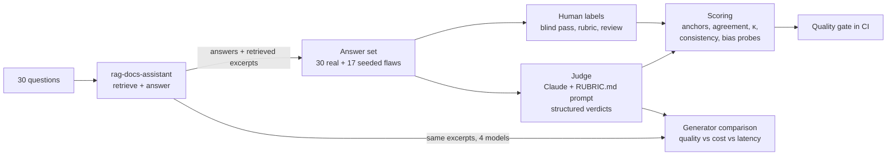

# Grounded Answer Judge

An LLM-as-judge that grades a RAG assistant's answers on three things (**faithful** to the retrieved docs, **relevant** to the question, **cited correctly**), plus the work to find out how far that judge can be trusted, and then using it to pick which Claude model should write the answers.

Built to demonstrate evaluating *generation*, not just retrieval: a rubric, human labels, a judge measured against both, repeated runs for consistency, bias probes, a model comparison on quality versus cost and latency, and a CI gate that fails if the judge or the answers get worse.

**Part of a learning path:**
1. [rag-docs-assistant](https://github.com/DaleShockley/rag-docs-assistant): build a RAG system and measure *retrieval*
2. [sprint-risk-agent](https://github.com/DaleShockley/sprint-risk-agent): build a tool-using agent and measure it against a baseline
3. **grounded-answer-judge** (this repo): measure *answer quality*, and when an AI grader can be trusted

## The problem

rag-docs-assistant scored 100% on its retrieval eval ("was the right file retrieved?"), yet it still gave unhelpful answers to 4 of 26 answerable questions: the right file came back, but not the right *section*. Retrieval metrics don't tell you whether the answer is any good. Grading answers by hand doesn't scale, so the obvious move is to have a model grade them. That raises the real question: **when can you trust the grader?**

## Results at a glance

| Question | Answer |
|---|---|
| Does the judge catch known flaws? | **17/17** seeded flaws (fabricated details, contradictions, wrong citations, off-topic, incomplete, made-up answers), in every run |
| Does it follow the rubric on judgment calls? | **8–9 of 9** rubric cases with prompt v2, up from 5/9 with v1. Same model; the prompt was the fix |
| Is it consistent? | **95%** of verdicts identical across 3 runs; the 5% that change sit in the rubric's gray zones |
| Is it fooled by length or confident tone? | No: 19/20 padded answers and 14/14 "this is explicitly documented" flaws graded the same |
| Can a human's labels be the ground truth? | Not without checking them: a blind first pass caught 6/17 seeded flaws (lesson 27) |
| Which model should write the answers? | All four tied on quality (29–30/30), so cost and speed decide: **Sonnet 5** is now the default, 25% cheaper and 40% faster than Sonnet 4.5 |
| Does CI catch a bad judge? | Yes: a "be generous" prompt edit dropped to 14/17 and 4/9 and failed the gate |

The full log, with 35 lessons each tied to a measured result, is in [**LESSONS_LEARNED.md**](LESSONS_LEARNED.md).

## How it works



- **The judge only sees what a real grader would:** the question, the retrieved excerpts, and the answer. It never sees the expected docs or which answers had flaws planted.
- **Verdicts are structured output** (a pydantic model via `messages.parse`), with the reasoning written before each verdict.
- **Anchor cases** are answers whose right grade is known independently of any grader: 17 seeded flaws and 9 rubric cases. They're what the judge is really scored on, and what the CI gate checks.

## What surprised me

- **Human labels needed as much scrutiny as the judge.** The first blind labeling pass graded each answer as a whole instead of per criterion (44 of 47 answers got the same grade on all three) and missed every wrong citation. Then, when reviewing disagreements with the judge's reasoning on screen, 46 of 48 went the judge's way. That's automation bias, and it made the "after" agreement partly circular. Both passes are kept, the caveat is reported, and the judge is now scored on anchors instead.
- **The prompt mattered more than the model.** Every judge v1 miss on the rubric cases was a rule it had never been given. Writing `RUBRIC.md` into the prompt fixed them on the same model.
- **Repeated runs are a rubric debugger.** The verdicts that changed between identical runs clustered in the same three unclear rules, which are now listed as open gaps.
- **The generator comparison was a tie, and that's the finding.** Opus 5.5 costs 7× more than Haiku 4.5, but every model declined the same three questions, because the right section was never retrieved. The ceiling is retrieval, and this question set is too easy to separate the models.
- **A degraded judge still looks respectable.** The softened prompt caught 82% of seeded flaws. What it lost were the subtle ones (a claim that's true but not in the excerpts, incomplete answers), which is exactly what a judge is for.

## Limitations

- **Small:** 47 answers, 30 questions, one documentation corpus (5 FastAPI tutorial pages). The findings are directional, not general.
- **The 9 rubric cases shaped prompt v2**, so they're a development check, not a held-out test.
- **One human labeler, and the reviewed labels are anchored** to judge v1 (see above).
- **Seeded flaws are cleaner than real ones:** one clean defect each, written by a model. The most informative failures turned out to be the unplanted ones.
- **The judge (Sonnet 5) graded its own model's answers.** A Haiku second opinion showed no sign of self-preference, but that's a weak check at this size.

## Project structure

```
grounded-answer-judge/
├── RUBRIC.md                    # the grading rules (faithful / relevant / cited correctly)
├── LESSONS_LEARNED.md           # every result and lesson, phase by phase
├── prompts/                     # judge prompts: v1, v2 (rubric-based), lenient (deliberately bad, for the gate)
├── data/
│   ├── questions.json           # 30 questions (26 answerable, 4 not)
│   ├── answers.jsonl            # 47 answers: 30 real + 17 seeded flaws (see data/README.md)
│   ├── human_labels.jsonl       # blind first-pass labels
│   ├── reviewed_labels.jsonl    # after disagreement review + rubric corrections
│   ├── probes.jsonl             # bias probes (padded / confident)
│   └── generators/              # the 30 questions answered by 4 models from identical excerpts
├── src/
│   ├── build_answer_set.py      # injects seeded flaws (structured output)
│   ├── judge.py, run_judge.py   # the judge, and a resumable runner with cost/latency tracking
│   └── make_labeling_page.py, make_review_page.py   # blind labeling + review pages
├── labeling/                    # page templates (the generated pages aren't committed)
├── eval/
│   ├── score_agreement.py       # agreement, Cohen's kappa, disagreements, seeded-flaw recall
│   ├── compare_judges.py        # prompt × model × runs: anchors, consistency, cost
│   ├── bias_probes.py           # length and tone probes
│   ├── compare_generators.py    # answer models: quality vs cost vs latency
│   └── quality_gate.py          # CI gate; minimums in gate_thresholds.json
├── results/                     # every judge run and report
├── tests/                       # 36 tests, no API key needed
└── .github/workflows/           # ci.yml (tests + gate, every push), live-eval.yml (manual, real API)
```

## Running it

```bash
git clone https://github.com/DaleShockley/grounded-answer-judge.git
cd grounded-answer-judge
pip install -r requirements.txt

pytest                                  # 36 tests, no API key needed
python -m eval.quality_gate             # gate on the committed results

# with ANTHROPIC_API_KEY in your environment or a .env file:
python -m src.run_judge --prompt v2 --model claude-sonnet-5 --tag r4     # grade the 47 answers (~$0.38)
python -m eval.compare_judges                                           # compare every judge run
python -m src.make_labeling_page                                        # label answers yourself
```

To run the live gate on GitHub, add an `ANTHROPIC_API_KEY` repository secret, then use **Actions → Live eval → Run workflow**. Enter `lenient` as the prompt to watch the gate fail.

**Cost:** everything in `results/` (every judge run, both judge models, four generators) came to about **$4** of API usage.

Built with Claude (Claude Code) as a pair programmer. The labeling and the rubric decisions are mine.
